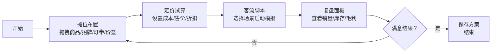

## 1. 产品概述
「摆摊试营业模拟器」是一款面向副业尝试者和大学生创业人群的Web应用，帮助用户在零成本前提下模拟不同摆摊经营方案的结果。用户可以通过拖拽方式设计摊位布局、试算定价策略、选择不同场景触发客流变化，并获得数据化的经营复盘。

- 核心价值：降低摆摊创业试错成本，提供数据化的选品、定价、陈列决策支持
- 目标用户：副业尝试者、大学生创业人群、对线下零售感兴趣的新手经营者

## 2. 核心功能

### 2.1 用户角色
| 角色 | 注册方式 | 核心权限 |
|------|----------|----------|
| 普通用户 | 无需注册，直接使用 | 完整使用所有模拟功能，保存本地方案 |

### 2.2 功能模块
1. **摊位布置模块**：商品库、招牌库、灯带库、价签库、拖拽画布、属性面板
2. **定价试算模块**：商品成本录入、目标利润率设置、折扣策略配置、实时收益预览
3. **客流脚本模块**：场景选择（夜市/校园/展会）、客流参数展示、顾客偏好说明、模拟运行控制
4. **复盘面板模块**：销量趋势图、库存变化表、毛利分析、经营建议

### 2.3 页面详情
| 页面名称 | 模块名称 | 功能描述 |
|-----------|-------------|---------------------|
| 主工作台 | 顶部导航栏 | Logo、模块切换标签页、保存/重置按钮 |
| 主工作台 | 摊位布置区 | 左侧素材库、中间画布（拖拽交互）、右侧属性面板 |
| 主工作台 | 定价试算区 | 商品列表表格、成本/售价/利润输入、折扣规则配置器 |
| 主工作台 | 客流脚本区 | 场景卡片选择器、客流参数面板、模拟运行控制按钮 |
| 主工作台 | 复盘面板区 | 图表可视化区（销量/库存/毛利）、关键指标卡、经营建议输出 |

## 3. 核心流程
用户进入应用后，首先在「摊位布置」模块拖拽商品、招牌、灯带、价签到画布上完成摊位设计；然后切换到「定价试算」模块，为每个商品设置成本、售价和折扣策略；接着进入「客流脚本」模块选择经营场景并启动模拟；最后在「复盘面板」中查看模拟结果，根据数据调整方案并重复迭代。

## 4. 用户界面设计

### 4.1 设计风格
- **主色调**：暖橙色系（#FF8C42 为主色），搭配深棕色（#3E2723）文字，营造夜市/地摊的烟火气息
- **辅助色**：霓虹粉（#FF4D6D）、荧光绿（#7CB518）、星空蓝（#3A86FF）用于灯带和点缀
- **按钮风格**：圆角胶囊形按钮，主按钮带有微微渐变和阴影，Hover时轻微上浮
- **字体**：标题使用「ZCOOL KuaiLe」（站酷快乐体，活泼有趣），正文使用「Noto Sans SC」（思源黑体，易读性强）
- **布局风格**：卡片式布局，每个模块使用独立的圆角卡片，带有轻微的夜市灯牌发光效果
- **图标风格**：使用手绘风格emoji和SVG图标，增加趣味性和亲和力

### 4.2 页面设计概述
| 页面名称 | 模块名称 | UI元素 |
|-----------|-------------|-------------|
| 主工作台 | 顶部导航栏 | 深色渐变背景，霓虹灯带装饰效果，胶囊形标签页切换 |
| 主工作台 | 摊位布置区 | 左侧素材库（网格布局+拖拽手柄），中间画布（木质纹理背景+网格参考线），右侧属性面板（滑动抽屉式） |
| 主工作台 | 定价试算区 | 商品表格（可编辑单元格），折扣策略滑块，实时收益仪表盘 |
| 主工作台 | 客流脚本区 | 场景卡片（大图+场景描述+参数标签），模拟进度条，顾客弹幕动画 |
| 主工作台 | 复盘面板区 | 彩色折线/柱状图，指标数据卡片（大号数字+趋势箭头），建议卡片（灯泡图标+文字） |

### 4.3 响应式
- Desktop-first设计，优先优化1440px宽度
- 画布区域采用自适应布局，最小支持1024px宽度
- 移动端适配：素材库改为底部抽屉式，画布纵向布局
- 拖拽操作支持触摸屏手势

### 4.4 视觉特效
- **霓虹灯带效果**：招牌和灯带元素带有CSS发光动画（box-shadow + animation）
- **客流模拟**：模拟运行时画布上出现流动的顾客小头像动画
- **数字跳动**：复盘中的数据变化使用数字滚动动画
- **拖拽反馈**：被拖拽元素半透明放大，目标位置显示放置提示框
