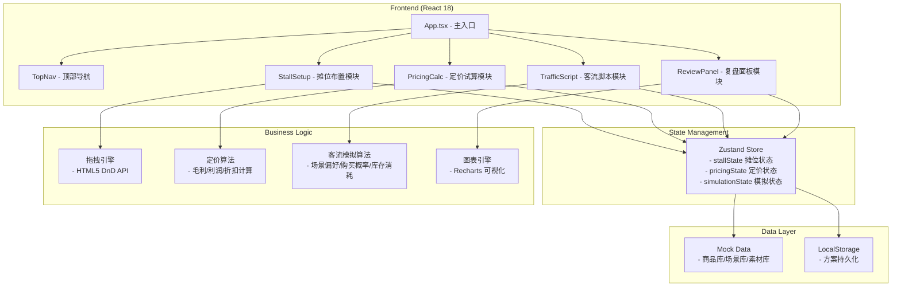
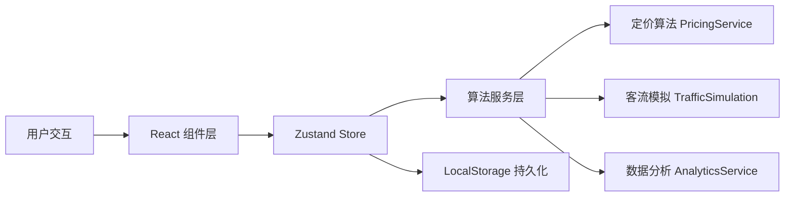
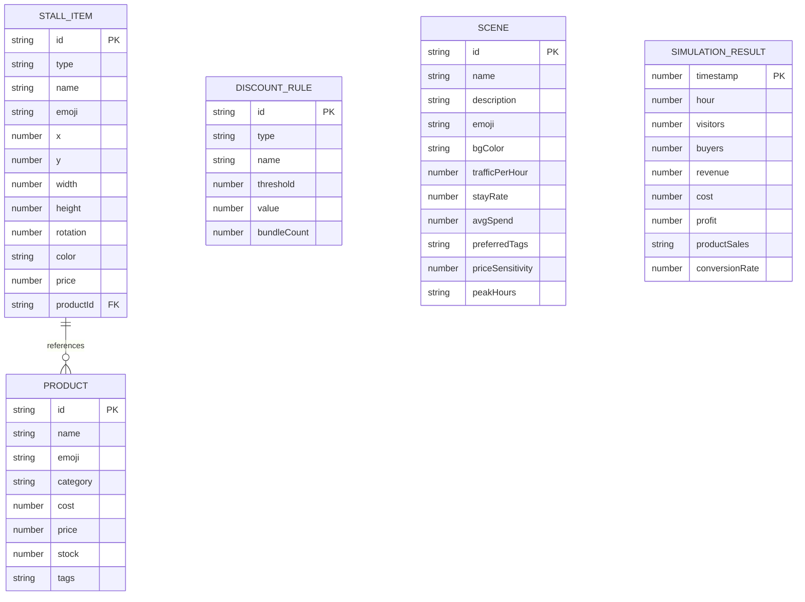

## 1. 架构设计



## 2. 技术描述
- **前端框架**：React@18 + TypeScript@5
- **构建工具**：Vite@5
- **样式方案**：TailwindCSS@3 + CSS Variables（霓虹效果）
- **状态管理**：Zustand@4（轻量级，支持localStorage持久化）
- **拖拽实现**：@dnd-kit/core + @dnd-kit/sortable（现代拖拽库，支持触摸）
- **图表库**：Recharts@2（基于SVG的React图表库）
- **UI组件**：自研组件（不使用组件库，保持设计独特性）
- **图标**：Lucide React（轻量SVG图标）+ Emoji
- **后端**：无，纯前端实现
- **数据库**：无，使用LocalStorage持久化用户方案
- **Mock数据**：内置商品库、场景库、素材库数据

## 3. 路由定义
| Route | 用途 |
|-------|------|
| / | 主工作台（单页应用，使用Tab切换模块而非路由） |

> 说明：由于是单页工具类应用，使用Tab标签页切换不同功能模块，不引入React Router。

## 4. API Definitions（无后端）
本应用为纯前端应用，所有数据处理在本地完成。以下为核心数据类型定义：

```typescript
// 摊位元素类型
interface StallItem {
  id: string;
  type: 'product' | 'signboard' | 'lightstrip' | 'pricetag';
  name: string;
  emoji: string;
  x: number;
  y: number;
  width: number;
  height: number;
  rotation: number;
  color?: string;
  price?: number;
  productId?: string;
}

// 商品类型
interface Product {
  id: string;
  name: string;
  emoji: string;
  category: string;
  cost: number;      // 成本价
  price: number;     // 售价
  stock: number;     // 初始库存
  tags: string[];    // 商品标签（用于客流偏好匹配）
}

// 折扣策略
interface DiscountRule {
  id: string;
  type: 'percentage' | 'fixed' | 'bundle';  // 折扣/满减/捆绑
  name: string;
  threshold?: number;   // 满减门槛
  value: number;        // 折扣值
  bundleCount?: number; // 捆绑数量
}

// 客流场景
interface Scene {
  id: string;
  name: string;
  description: string;
  emoji: string;
  bgColor: string;
  trafficPerHour: number;    // 每小时客流量
  stayRate: number;          // 驻足率 0-1
  avgSpend: number;          // 客单价
  preferredTags: string[];   // 偏好标签
  priceSensitivity: number;  // 价格敏感度 0-1
  peakHours: [number, number][]; // 高峰时段
}

// 模拟结果
interface SimulationResult {
  timestamp: number;
  hour: number;
  visitors: number;          // 访客数
  buyers: number;            // 购买人数
  revenue: number;           // 营收
  cost: number;              // 成本
  profit: number;            // 利润
  productSales: Record<string, { sold: number; remaining: number }>;
  conversionRate: number;    // 转化率
}

// 全局状态
interface AppState {
  activeTab: 'setup' | 'pricing' | 'traffic' | 'review';
  stallItems: StallItem[];
  products: Product[];
  discountRules: DiscountRule[];
  selectedScene: Scene | null;
  simulationResults: SimulationResult[];
  isSimulating: boolean;
  simulationHours: number;
}
```

## 5. Server Architecture Diagram（无后端）
纯前端应用，所有算法在浏览器端执行：



## 6. Data Model

### 6.1 Data Model Definition



### 6.2 初始Mock数据
- **商品库**：20种常见摆摊商品（小吃、饮品、饰品、玩具、文创等）
- **素材库**：8种招牌样式、6种灯带颜色、4种价签样式
- **场景库**：夜市、校园门口、周末展会、商圈步行街4个场景
- **默认方案**：预设一套完整的「夜市小吃摊」方案用于首次体验
